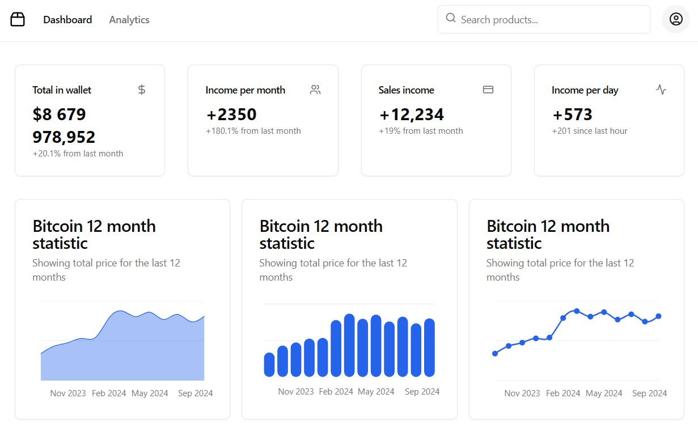
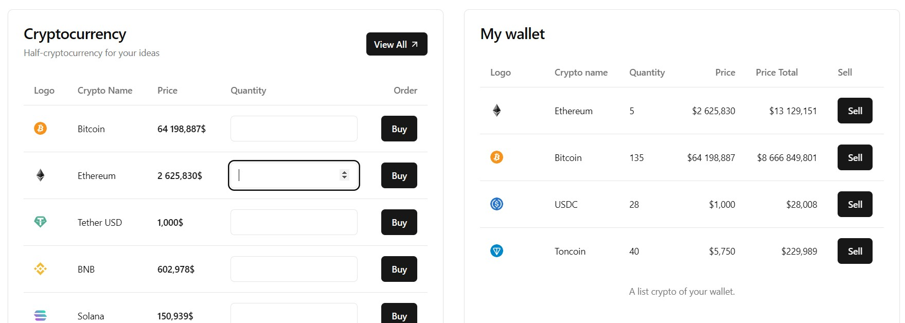

### **Описание проекта: Аналитика крипто кошелька**
Проект представляет собой инструмент для анализа и прогнозирования доходности криптовалютных инвестиций. Основные функции:

1. **Анализ купленной криптовалюты**
   Проект отслеживает данные о приобретенной криптовалюте и анализирует, сколько прибыли или убытков можно было бы получить за определённые временные интервалы, основываясь на прошлых ценах.
1. **Эмуляция покупки криптовалюты**
   На дашборде можно симулировать покупку криптовалюты в различных временных точках, чтобы увидеть, сколько можно было бы заработать, если бы инвестиция была сделана, например, месяц назад или в более ранний срок.
1. **Сравнение итогового бюджета**
   Проект позволяет сравнивать текущий бюджет с гипотетическим, показывая, сколько бы вы заработали или потеряли при покупке криптовалюты в разных временных интервалах.
1. **Прогнозирование доходности**
   Система также предсказывает, сколько можно заработать, если продать купленную криптовалюту по текущим ценам, на основе актуальных рыночных данных.
-----
**Дисклеймер:**
*Проект представляет собой инструмент для анализа и прогнозирования доходности криптовалютных инвестиций. Создан с целью ознакомления, не является инвестиционной рекомендацией, не является продуктом для использования в инвестиционных операциях, а также в операциях на фондовом и криптовалютном рынке или других инвестиционных продуктах. Автор данного дашборда не несет никакой ответственности за его использование, так как приложение создано исключительно в ознакомительных целях. Приложение не побуждает к покупке криптовалюты или акций фондового рынка.*

-----
### **Технический стек:**
- **React**: Используется для создания пользовательского интерфейса и управления состоянием приложения.
- **Zod**: Применяется для валидации данных, полученных от API.
- **React Query**: Для работы с асинхронными запросами и кэширования данных.
- **Recharts**: Библиотека для создания интерактивных графиков и визуализации данных.
- **ShadCN UI**: Для создания настраиваемых и удобных компонентов интерфейса.
- **React Router**: Обеспечивает маршрутизацию внутри приложения.
- **Lucide-React**: Используется для интеграции иконок в интерфейсе.
- **Axios**: Для отправки запросов к API и получения данных.
- **TailwindCSS**: Используется для стилизации компонентов и создания адаптивного интерфейса.
